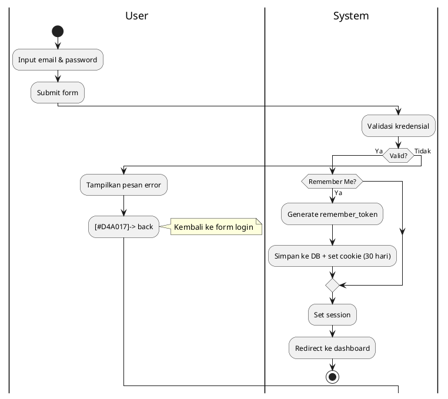
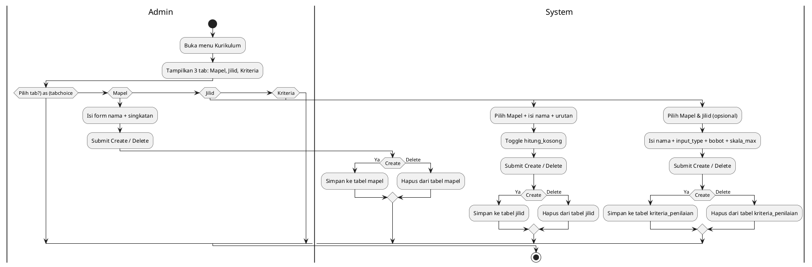
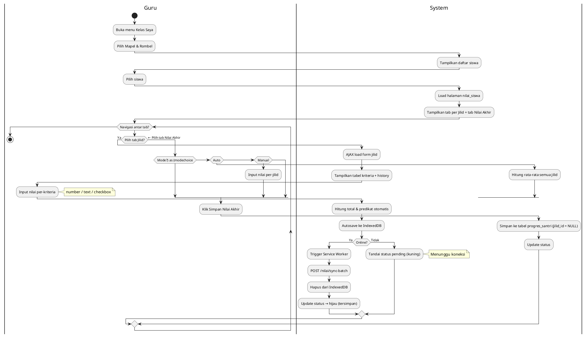
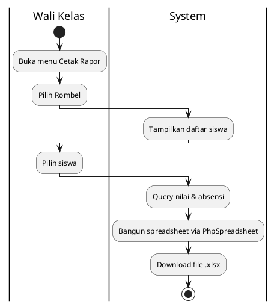
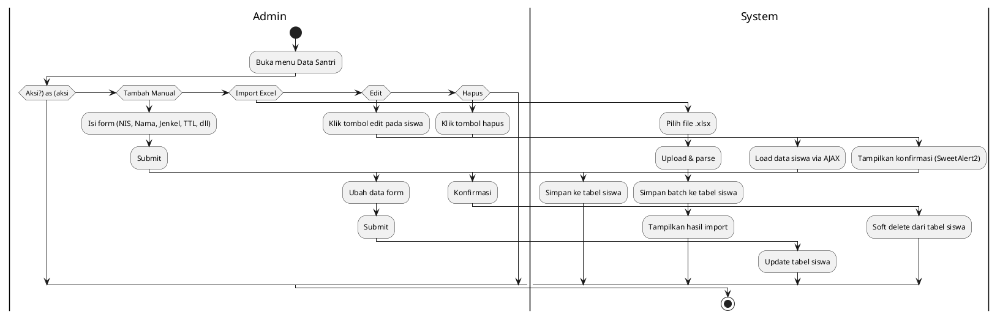
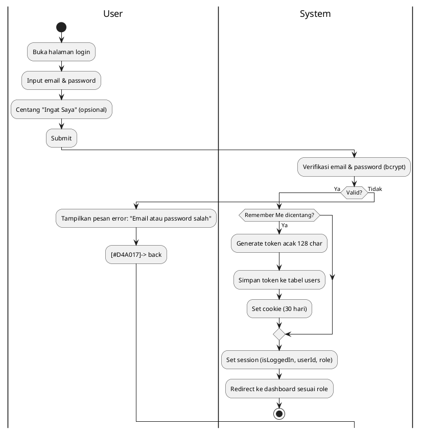

# Activity Diagram — SIM Al-Miftah

---

## 1. Login



---

## 2. Kelola Kurikulum (Admin)



---

## 3. Input Nilai (Guru) — Flow Utama



---

## 4. Presensi (Guru)

```plantuml
@startuml
|Guru|
start
:Buka menu Presensi;
:Pilih Mapel & Rombel;
:Pilih Tanggal;
|System|
:Tampilkan daftar siswa;
|Guru|
for each siswa
  :Pilih status: Hadir / Sakit / Izin / Alpha;
endfor
|Guru|
:Klik Simpan Semua;
|System|
:Upsert batch ke tabel presensi;
:Tampilkan notifikasi sukses;
stop
@enduml
```

---

## 5. Lihat Rapor (Wali Kelas)

```plantuml
@startuml
|Wali Kelas|
start
:Buka menu Rapor Kelas;
:Pilih Rombel;
:Pilih Tahun Ajaran;
|System|
:Query progres_santri per siswa per mapel;
:Query presensi per siswa;
:Tampilkan rapor kelas (accordion);
|Wali Kelas|
for each siswa
  :Lihat nilai semua mapel + predikat;
  :Lihat ringkasan absensi;
endfor
stop
@enduml
```

---

## 6. Cetak Rapor Excel (Wali Kelas)



---

## 7. Kelola Santri (Admin)



---

## 8. Offline Sync (Service Worker + IndexedDB)

```plantuml
@startuml
start
:Input nilai saat offline;
:Simpan ke IndexedDB (status: pending);
:Tandai status global → kuning;
note right: Data tersimpan lokal

:Menunggu koneksi kembali...;
while (Belum online?)
  :-- idle --;
endwhile

:Event 'online' terdeteksi / klik Sync;
:Baca semua item pending dari IndexedDB;
:Kirim message ke Service Worker;
:SW fetch POST /nilai/sync-batch;
|System|
if (Response 200 OK?) then (Ya)
  :Hapus item dari IndexedDB;
  :Broadcast 'sync-success' ke halaman;
  :Update status global → hijau;
  :Tampilkan notifikasi sukses;
else (Gagal)
  :Biarkan tetap di IndexedDB;
  :Tampilkan pesan error;
  -[#D4A017]-> back
  note right: Retry nanti
endif
stop
@enduml
```

---

## 9. Login dengan Remember Me


