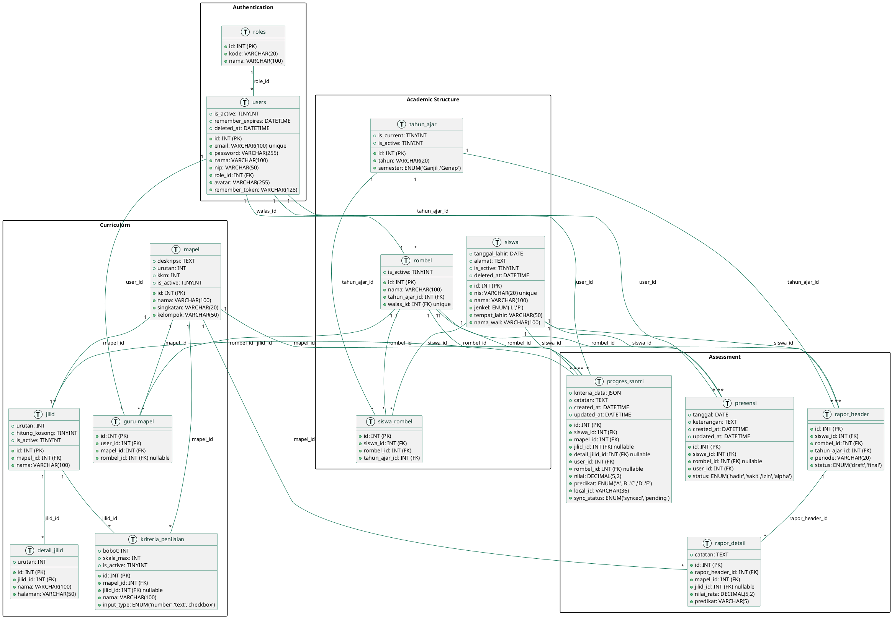

# Class Diagram — SIM Al-Miftah

```plantuml
@startuml
!define table(x) class x << (T,#F0FDFA) >>

skinparam classBorderColor #046C4E
skinparam classFontColor #022C22
skinparam arrowColor #046C4E
skinparam packageStyle rectangle

package "Authentication" {
  table(roles) {
    + id: INT (PK)
    + kode: VARCHAR(20)
    + nama: VARCHAR(100)
  }

  table(users) {
    + id: INT (PK)
    + email: VARCHAR(100) unique
    + password: VARCHAR(255)
    + nama: VARCHAR(100)
    + nip: VARCHAR(50)
    + role_id: INT (FK)
    + is_active: TINYINT
    + avatar: VARCHAR(255)
    + remember_token: VARCHAR(128)
    + remember_expires: DATETIME
    + deleted_at: DATETIME
  }
}

package "Academic Structure" {
  table(tahun_ajar) {
    + id: INT (PK)
    + tahun: VARCHAR(20)
    + semester: ENUM('Ganjil','Genap')
    + is_current: TINYINT
    + is_active: TINYINT
  }

  table(rombel) {
    + id: INT (PK)
    + nama: VARCHAR(100)
    + tahun_ajar_id: INT (FK)
    + walas_id: INT (FK) unique
    + is_active: TINYINT
  }

  table(siswa) {
    + id: INT (PK)
    + nis: VARCHAR(20) unique
    + nama: VARCHAR(100)
    + jenkel: ENUM('L','P')
    + tempat_lahir: VARCHAR(50)
    + tanggal_lahir: DATE
    + alamat: TEXT
    + nama_wali: VARCHAR(100)
    + is_active: TINYINT
    + deleted_at: DATETIME
  }

  table(siswa_rombel) {
    + id: INT (PK)
    + siswa_id: INT (FK)
    + rombel_id: INT (FK)
    + tahun_ajar_id: INT (FK)
  }
}


package "Curriculum" {
  table(mapel) {
    + id: INT (PK)
    + nama: VARCHAR(100)
    + singkatan: VARCHAR(20)
    + deskripsi: TEXT
    + kelompok: VARCHAR(50)
    + urutan: INT
    + kkm: INT
    + is_active: TINYINT
  }

  table(jilid) {
    + id: INT (PK)
    + mapel_id: INT (FK)
    + nama: VARCHAR(100)
    + urutan: INT
    + hitung_kosong: TINYINT
    + is_active: TINYINT
  }

  table(detail_jilid) {
    + id: INT (PK)
    + jilid_id: INT (FK)
    + nama: VARCHAR(100)
    + halaman: VARCHAR(50)
    + urutan: INT
  }

  table(kriteria_penilaian) {
    + id: INT (PK)
    + mapel_id: INT (FK)
    + jilid_id: INT (FK) nullable
    + nama: VARCHAR(100)
    + bobot: INT
    + skala_max: INT
    + input_type: ENUM('number','text','checkbox')
    + is_active: TINYINT
  }

  table(guru_mapel) {
    + id: INT (PK)
    + user_id: INT (FK)
    + mapel_id: INT (FK)
    + rombel_id: INT (FK) nullable
  }
}

package "Assessment" {
  table(progres_santri) {
    + id: INT (PK)
    + siswa_id: INT (FK)
    + mapel_id: INT (FK)
    + jilid_id: INT (FK) nullable
    + detail_jilid_id: INT (FK) nullable
    + user_id: INT (FK)
    + rombel_id: INT (FK) nullable
    + nilai: DECIMAL(5,2)
    + predikat: ENUM('A','B','C','D','E')
    + kriteria_data: JSON
    + catatan: TEXT
    + local_id: VARCHAR(36)
    + sync_status: ENUM('synced','pending')
    + created_at: DATETIME
    + updated_at: DATETIME
  }

  table(presensi) {
    + id: INT (PK)
    + siswa_id: INT (FK)
    + rombel_id: INT (FK) nullable
    + user_id: INT (FK)
    + status: ENUM('hadir','sakit','izin','alpha')
    + tanggal: DATE
    + keterangan: TEXT
    + created_at: DATETIME
    + updated_at: DATETIME
  }

  table(rapor_header) {
    + id: INT (PK)
    + siswa_id: INT (FK)
    + rombel_id: INT (FK)
    + tahun_ajar_id: INT (FK)
    + periode: VARCHAR(20)
    + status: ENUM('draft','final')
  }

  table(rapor_detail) {
    + id: INT (PK)
    + rapor_header_id: INT (FK)
    + mapel_id: INT (FK)
    + jilid_id: INT (FK) nullable
    + nilai_rata: DECIMAL(5,2)
    + predikat: VARCHAR(5)
    + catatan: TEXT
  }
}

' ===================== RELATIONSHIPS =====================

roles "1" -- "*" users : role_id
users "1" -- "1" rombel : walas_id
users "1" -- "*" guru_mapel : user_id
users "1" -- "*" progres_santri : user_id
users "1" -- "*" presensi : user_id

tahun_ajar "1" -- "*" rombel : tahun_ajar_id
tahun_ajar "1" -- "*" siswa_rombel : tahun_ajar_id
tahun_ajar "1" -- "*" rapor_header : tahun_ajar_id

rombel "1" -- "*" siswa_rombel : rombel_id
rombel "1" -- "*" guru_mapel : rombel_id
rombel "1" -- "*" progres_santri : rombel_id
rombel "1" -- "*" presensi : rombel_id
rombel "1" -- "*" rapor_header : rombel_id

siswa "1" -- "*" siswa_rombel : siswa_id
siswa "1" -- "*" progres_santri : siswa_id
siswa "1" -- "*" presensi : siswa_id
siswa "1" -- "*" rapor_header : siswa_id

mapel "1" -- "*" jilid : mapel_id
mapel "1" -- "*" kriteria_penilaian : mapel_id
mapel "1" -- "*" guru_mapel : mapel_id
mapel "1" -- "*" progres_santri : mapel_id
mapel "1" -- "*" rapor_detail : mapel_id

jilid "1" -- "*" detail_jilid : jilid_id
jilid "1" -- "*" kriteria_penilaian : jilid_id
jilid "1" -- "*" progres_santri : jilid_id

rapor_header "1" -- "*" rapor_detail : rapor_header_id

@enduml
```
