# Diagram Sistem Informasi Akademik Al-Miftah

Dokumen ini berisi **Activity Diagram** dan **Sequence Diagram** untuk setiap modul utama sistem.

---

## Daftar Isi

1. [Login](#1-login)
2. [Mengelola Master Data](#2-mengelola-master-data)
3. [Mengelola Data Akademik](#3-mengelola-data-akademik)
4. [Mengelola Nilai Santri](#4-mengelola-nilai-santri)
5. [Mengelola Presensi Santri](#5-mengelola-presensi-santri)
6. [Melihat Laporan Kelas](#6-melihat-laporan-kelas)
7. [Mencetak Laporan](#7-mencetak-laporan)
8. [Mengatur Profil](#8-mengatur-profil)

---

## 1. Login

### Activity Diagram

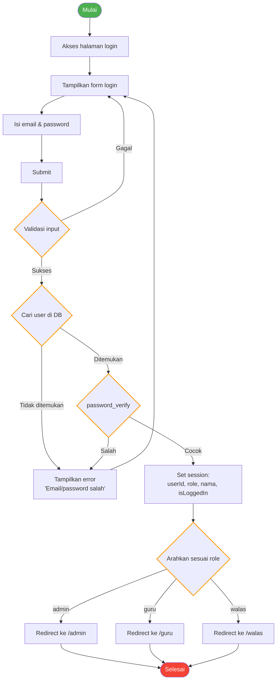

### Sequence Diagram

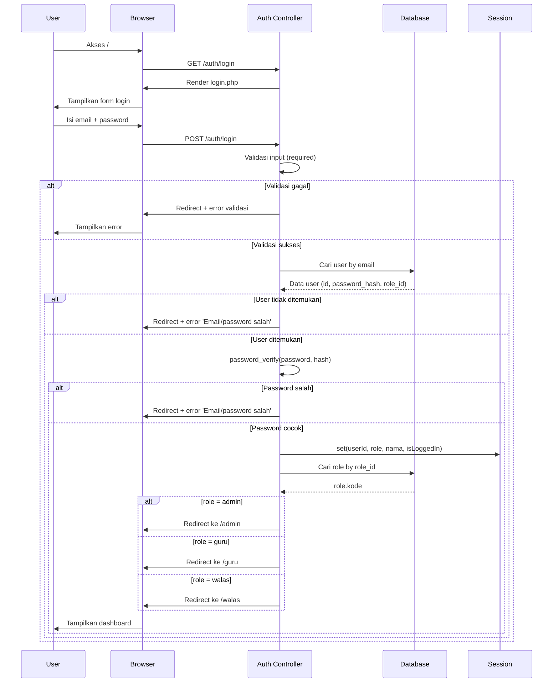

---

## 2. Mengelola Master Data

### 2.1 Data Siswa (CRUD)

#### Activity Diagram

```mermaid
flowchart TD
    A([Mulai]) --> B[Akses menu Data Santri]
    B --> C{Sudah login?}
    C -->|Ya| D[GET /admin/santri]
    D --> E[Tampilkan daftar santri<br/>+ fitur: Tambah, Edit, Hapus, Import Excel]
    E --> F{Pilih aksi}

    F -->|Tambah| G[Tampilkan form tambah]
    G --> H[Isi data santri]
    H --> I[Submit POST /admin/santri/store]
    I --> J{Validasi}
    J -->|Gagal| G
    J -->|Sukses| K[Simpan ke DB]
    K --> L[Flash message 'Berhasil']
    L --> E

    F -->|Edit| M[Pilih santri]
    M --> N[GET /admin/santri/get/{id}]
    N --> O[Tampilkan form edit]
    O --> P[Ubah data]
    P --> Q[Submit POST /admin/santri/update/{id}]
    Q --> R{Validasi}
    R -->|Gagal| O
    R -->|Sukses| S[Update DB]
    S --> L

    F -->|Hapus| T[Konfirmasi hapus]
    T --> U[POST /admin/santri/delete/{id}]
    U --> V[Soft delete DB]
    V --> L

    F -->|Import Excel| W[Pilih file .xlsx]
    W --> X[POST /admin/santri/import-excel]
    X --> Y[Proses & validasi tiap baris]
    Y --> Z{Ada error?}
    Z -->|Ya| AA[Tampilkan error per baris]
    AA --> W
    Z -->|Tidak| AB[Import batch ke DB]
    AB --> L

    C -->|Tidak| AC[Redirect ke login]
    AC --> AD([Selesai])

    style A fill:#4CAF50,color:#fff
    style AD fill:#f44336,color:#fff
    style F stroke:#FF9800,stroke-width:2px
    style J stroke:#FF9800,stroke-width:2px
    style R stroke:#FF9800,stroke-width:2px
    style Z stroke:#FF9800,stroke-width:2px
```

#### Sequence Diagram

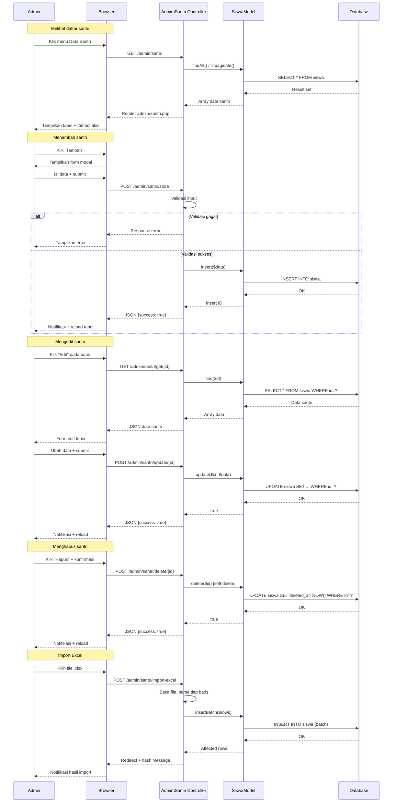

### 2.2 Data Guru (CRUD)

#### Activity Diagram

```mermaid
flowchart TD
    A([Mulai]) --> B[Akses menu Data Guru]
    B --> C[GET /admin/guru]
    C --> D[Tampilkan daftar guru<br/>+ fitur: Tambah, Edit, Hapus, Atur Mapel]
    D --> E{Pilih aksi}

    E -->|Tambah| F[Tampilkan form tambah]
    F --> G[Isi data guru + pilih role]
    G --> H[Submit POST /admin/guru/store]
    H --> I{Validasi}
    I -->|Gagal| F
    I -->|Sukses| J[Simpan user ke DB]
    J --> K[Simpan assignment mapel<br/>(jika ada)]
    K --> L[Flash message]
    L --> D

    E -->|Edit| M[Pilih guru]
    M --> N[GET /admin/guru/get/{id}]
    N --> O[Tampilkan form edit<br/>+ checkbox mapel]
    O --> P[Ubah data]
    P --> Q[Submit POST /admin/guru/update/{id}]
    Q --> R{Validasi}
    R -->|Gagal| O
    R -->|Sukses| S[Update user DB]
    S --> T[Hapus assignment lama]
    T --> U[Simpan assignment baru]
    U --> L

    E -->|Hapus| V[Konfirmasi]
    V --> W[POST /admin/guru/delete/{id}]
    W --> X[Soft delete user]
    X --> L

    E -->|Atur Mapel| Y[Pilih tahun ajar]
    Y --> Z[Tampilkan checkbox:<br/>mapel × rombel]
    Z --> AA[Centang/ubah]
    AA --> AB[Submit POST /admin/guru/assign/{id}]
    AB --> AC[Hapus assignment lama]
    AC --> AD[Simpan assignment baru]
    AD --> L

    style A fill:#4CAF50,color:#fff
    style L fill:#2196F3,color:#fff
    style E stroke:#FF9800,stroke-width:2px
    style I stroke:#FF9800,stroke-width:2px
    style R stroke:#FF9800,stroke-width:2px
```

#### Sequence Diagram

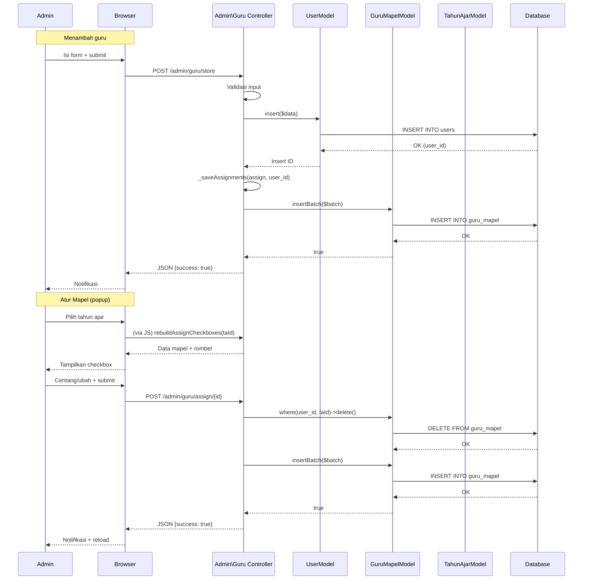

---

## 3. Mengelola Data Akademik

### Activity Diagram

```mermaid
flowchart TD
    A([Mulai]) --> B[Akses menu Akademik]
    B --> C{Pilih submenu}

    C -->|Tahun Ajar| D[GET /admin/tahun-ajar]
    D --> E[Tampilkan daftar tahun ajar]
    E --> F{Pilih aksi}
    F -->|Tambah| G[Form + submit]
    G --> H[Simpan tahun ajar]
    H --> E
    F -->|Edit| I[Form + submit]
    I --> J[Update tahun ajar]
    J --> E
    F -->|Set Aktif| K[POST set-active/{id}]
    K --> L[Nonaktifkan semua]
    L --> M[Aktifkan yang dipilih]
    M --> E
    F -->|Hapus| N[Konfirmasi + delete]
    N --> E

    C -->|Rombel| O[GET /admin/rombel]
    O --> P[Tampilkan daftar rombel]
    P --> Q{Pilih aksi}
    Q -->|Tambah| R[Form + submit]
    R --> S[Simpan rombel]
    S --> P
    Q -->|Edit| T[Form + submit]
    T --> U[Update rombel]
    U --> P
    Q -->|Assign Walas| V[Pilih walas]
    V --> W[POST assign-walas]
    W --> P

    C -->|Kurikulum| X[GET /admin/kurikulum]
    X --> Y[Tampilkan: Mapel, Kategori, Kriteria]
    Y --> Z{Pilih kelola}
    Z -->|Mapel| AA[CRUD mapel]
    Z -->|Kategori| AB[CRUD kategori]
    Z -->|Kriteria| AC[CRUD kriteria]

    style A fill:#4CAF50,color:#fff
    style C stroke:#FF9800,stroke-width:2px
    style F stroke:#FF9800,stroke-width:2px
    style Q stroke:#FF9800,stroke-width:2px
    style Z stroke:#FF9800,stroke-width:2px
```

### Sequence Diagram

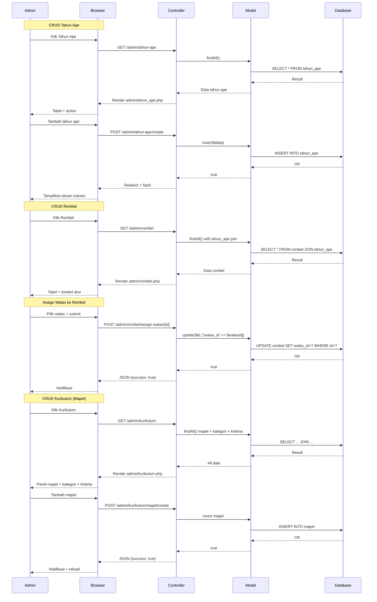

---

## 4. Mengelola Nilai Santri

### Activity Diagram

```mermaid
flowchart TD
    A([Mulai]) --> B[Login sebagai Guru]
    B --> C[Menu Kelas Saya]
    C --> D[GET /guru/input-saya]
    D --> E[Tampilkan card mapel × rombel]
    E --> F[Pilih mapel + rombel]
    F --> G[GET /guru/nilai/mapel/{mapelId}/kelas/{rombelId}]
    G --> H[Tampilkan tabel nilai:<br/>santri + kategori + input]
    H --> I{Pilih aksi}

    I -->|Input nilai| J[Klik sel nilai]
    J --> K[GET form kategori]
    K --> L[Input nilai + predikat]
    L --> M[Submit POST /guru/nilai/save]
    M --> N[Simpan ke progres_santri]
    N --> O[Hitung predikat otomatis]
    O --> P[Update tampilan]
    P --> H

    I -->|Input semua kategori| Q[Input nilai untuk setiap kategori]
    Q --> R[Submit POST /guru/nilai/save-akhir]
    R --> S[Simpan batch progres_santri<br/>+ hitung rata-rata]
    S --> P

    I -->|Lihat detail santri| T[Klik nama santri]
    T --> U[GET /guru/nilai/siswa/{siswaId}/mapel/{mapelId}/kelas/{rombelId}]
    U --> V[Tampilkan semua kategori + nilai]

    I -->|Sync batch| W[Submit POST /guru/nilai/sync-batch]
    W --> X[Update banyak nilai sekaligus]
    X --> P

    style A fill:#4CAF50,color:#fff
    style I stroke:#FF9800,stroke-width:2px
```

### Sequence Diagram

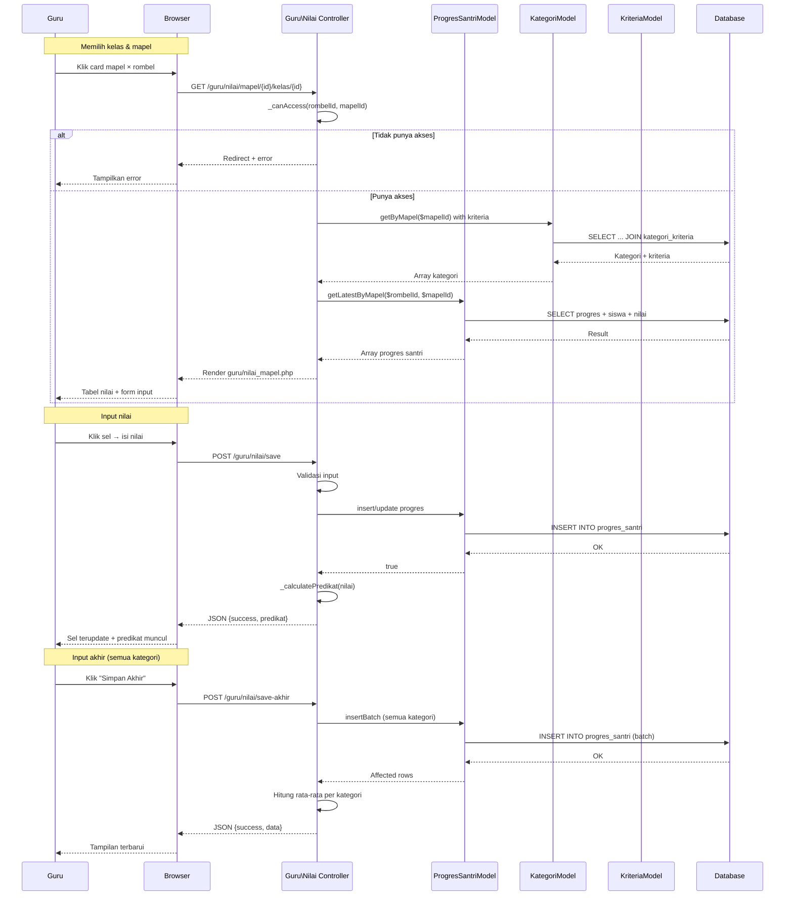

---

## 5. Mengelola Presensi Santri

### Activity Diagram

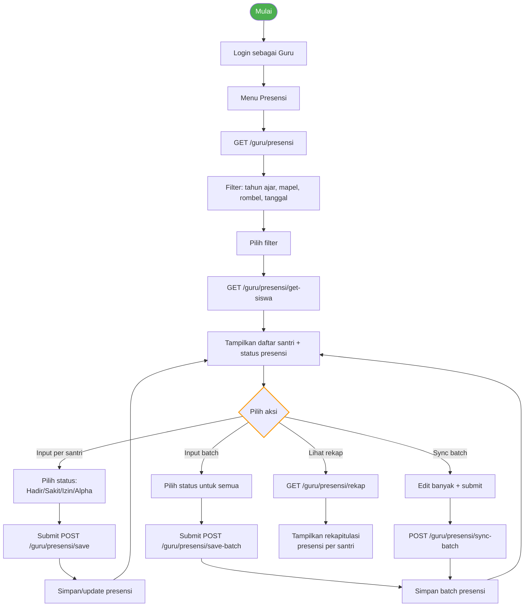

### Sequence Diagram

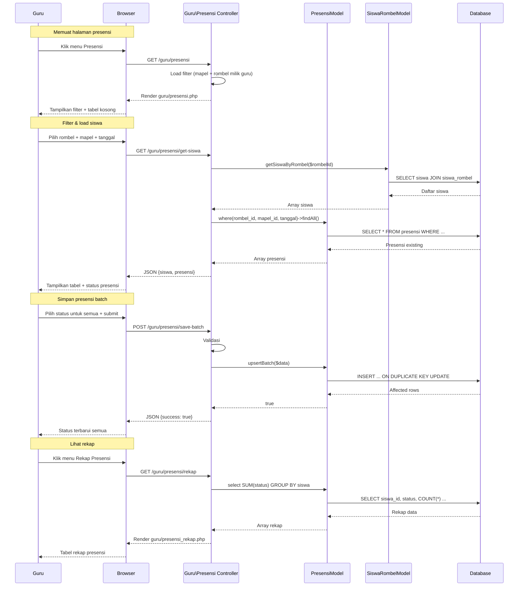

---

## 6. Melihat Laporan Kelas

### Activity Diagram

```mermaid
flowchart TD
    A([Mulai]) --> B[Login sebagai Wali Kelas]
    B --> C[Menu Rapor]
    C --> D[GET /walas/rapor]
    D --> E[Filter tahun ajar]
    E --> F[Tampilkan card grid rombel]
    F --> G[Klik card rombel]
    G --> H[GET /walas/rapor/kelas/{id}]
    H --> I[Tampilkan tabel santri + presensi]
    I --> J{Pilih aksi}

    J -->|Detail santri| K[Klik Detail]
    K --> L[GET /walas/rapor/siswa/{rombelId}/{siswaId}]
    L --> M[Tampilkan nilai per mapel<br/>+ presensi + peringkat]
    M --> N[Klik Cetak Rapor]
    N --> O[Download Excel]

    J -->|Cetak langsung| P[Klik Cetak di baris]
    P --> O

    J -->|Kembali| Q[Klik Kembali]
    Q --> F

    B --> R[Menu Rekapitulasi]
    R --> S[GET /walas/rekapitulasi]
    S --> T[Card grid rombel]
    T --> U[Klik card]
    U --> V[GET /walas/rekapitulasi/kelas/{id}]
    V --> W[Tampilkan tabel rekap nilai:<br/>santri × mapel + tuntas/tidak]

    style A fill:#4CAF50,color:#fff
    style J stroke:#FF9800,stroke-width:2px
```

### Sequence Diagram

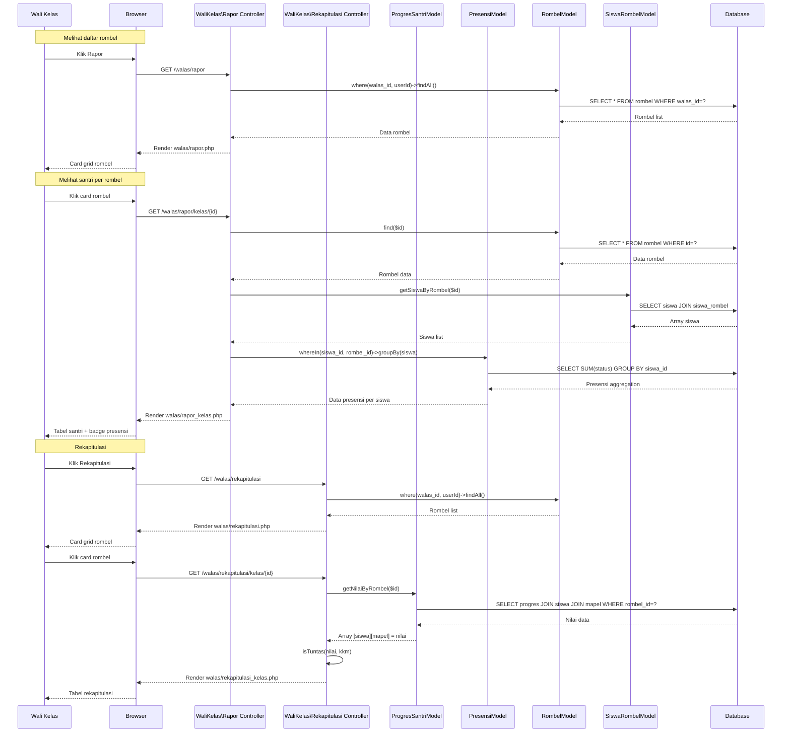

---

## 7. Mencetak Laporan

### Activity Diagram

```mermaid
flowchart TD
    A([Mulai]) --> B[Login sebagai Wali Kelas / Admin]
    B --> C[Menu Cetak Rapor]
    C --> D[GET /{role}/cetak]
    D --> E[Filter tahun ajar]
    E --> F[Tampilkan card grid rombel]
    F --> G[Klik card rombel]
    G --> H[GET /{role}/cetak/rombel/{id}]
    H --> I[Tampilkan tabel santri + tombol Cetak]
    I --> J[Klik Cetak Rapor]
    J --> K{Format apa?}

    K -->|Excel| L[GET /{role}/cetak/excel/{rombelId}/{siswaId}]
    L --> M[Load template format_rapor.xlsx]
    M --> N[Query data: nilai, presensi, siswa, walas]
    N --> O[Placeholder replacement:<br/>[NAMA_SISWA], [NILAI_1], dll]
    O --> P[Stream file .xlsx ke browser]
    P --> Q([Selesai])

    style A fill:#4CAF50,color:#fff
    style Q fill:#f44336,color:#fff
    style K stroke:#FF9800,stroke-width:2px
```

### Sequence Diagram

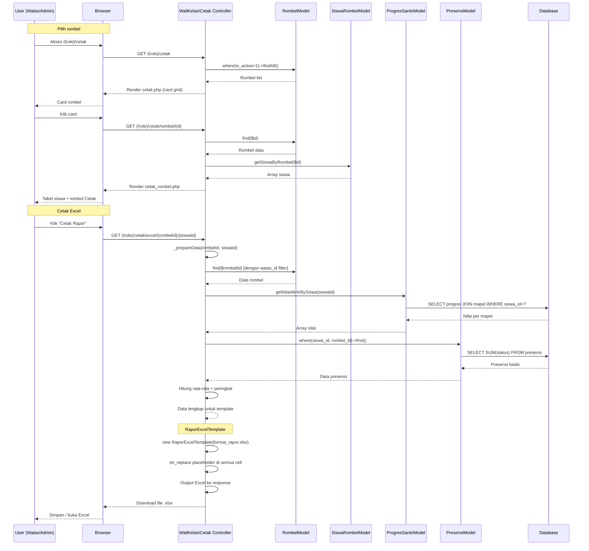

---

## 8. Mengatur Profil

### Activity Diagram

```mermaid
flowchart TD
    A([Mulai]) --> B[Login sebagai Admin / Guru / Walas]
    B --> C[Menu Profil]
    C --> D[GET /{role}/profil]
    D --> E[Tampilkan data profil:<br/>- Avatar inisial<br/>- Form: Nama, Email, NIP (readonly), Role (readonly)<br/>- Status Aktif<br/>- Ubah Password<br/>- Mata Pelajaran Diampu (Guru)]

    E --> F{Pilih aksi}

    F -->|Ubah Data Diri| G[Edit Nama / Email]
    G --> H[Submit POST /{role}/profil/update]
    H --> I{Validasi server}
    I -->|Nama/email kosong| J[Error 'wajib diisi']
    J --> G
    I -->|Email duplikat| K[Error 'sudah digunakan']
    K --> G
    I -->|Sukses| L[Update DB]
    L --> M[Update session 'nama']
    M --> N[Flash message 'Profil berhasil diperbarui']
    N --> E

    F -->|Ubah Password| O[Isi password lama + baru]
    O --> P{Validasi}
    P -->|Lama kosong| Q[Error]
    Q --> O
    P -->|Baru kosong| R[Error]
    R --> O
    P -->|Baru < 6 karakter| S[Error]
    S --> O
    P -->|Lama salah| T[Error 'tidak sesuai']
    T --> O
    P -->|Sukses| U[Hash password baru]
    U --> L

    F -->|Atur Penugasan (Guru)| V[Buka modal Atur Kelas]
    V --> W[Tampilkan checkbox:<br/>mapel × rombel]
    W --> X[Centang/ubah]
    X --> Y[Submit POST /guru/input-saya/assign]
    Y --> Z[Delete assignment lama<br/>(per tahun ajar)]
    Z --> AA[Insert batch baru]
    AA --> AB[Flash message]
    AB --> E

    style A fill:#4CAF50,color:#fff
    style F stroke:#FF9800,stroke-width:2px
    style I stroke:#FF9800,stroke-width:2px
    style P stroke:#FF9800,stroke-width:2px
```

### Sequence Diagram

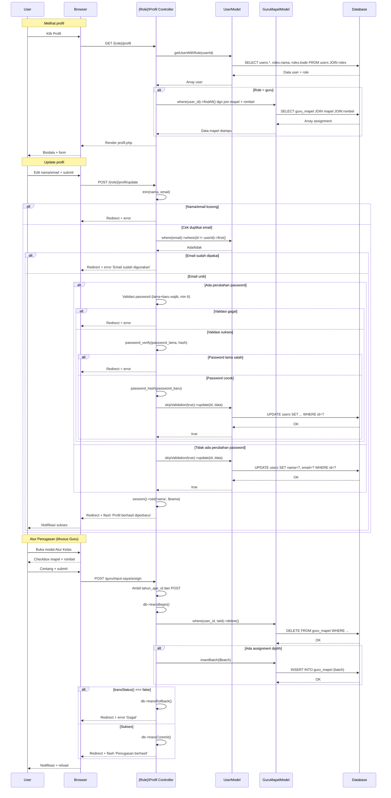

---

## Legenda

### Activity Diagram

| Simbol | Makna |
|--------|-------|
| `([Mulai])` / `([Selesai])` | Start / End |
| `[Persegi panjang]` | Action / Proses |
| `{Belah ketupat}` | Decision / Pilihan |
| `--[Label]-->` | Arrow dengan label |

### Sequence Diagram

| Simbol | Makna |
|--------|-------|
| `actor` | Pelaku (User) |
| `participant` | Komponen sistem |
| `->>` | Request / panggilan |
| `-->>` | Response / return |
| `alt ... else ... end` | Conditional branch |
| `Note over A,B` | Catatan / penjelasan |
