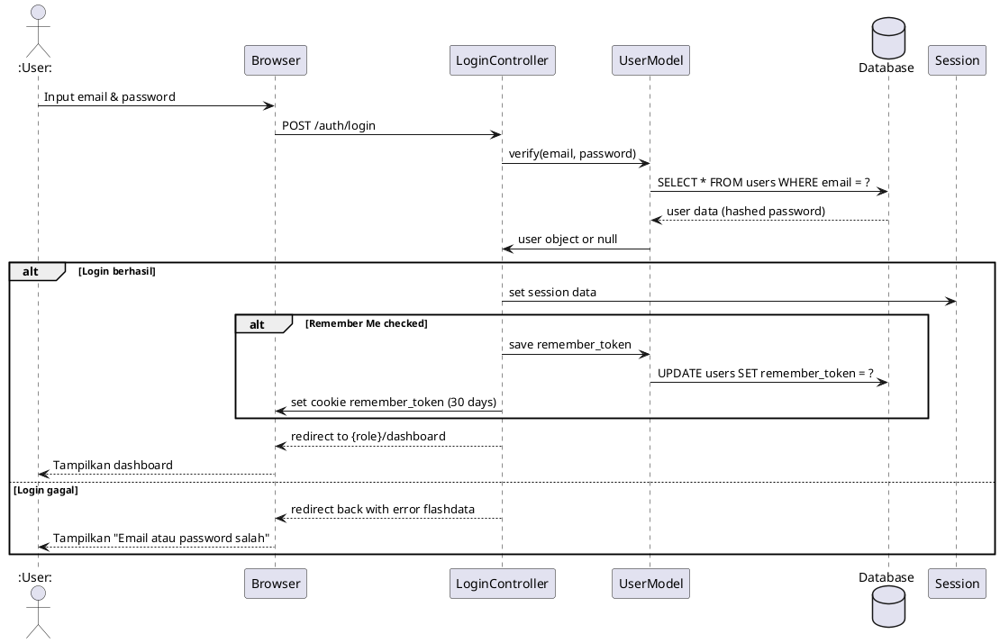
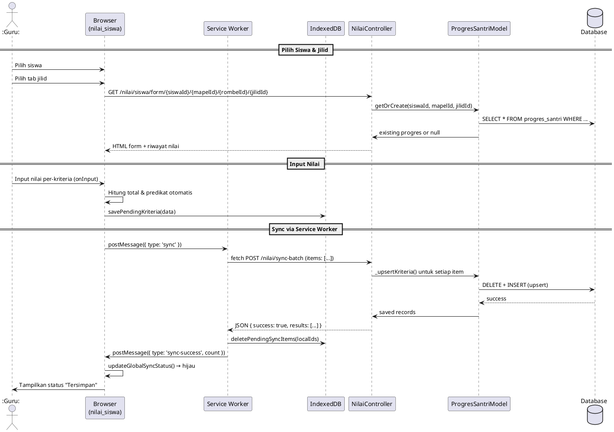
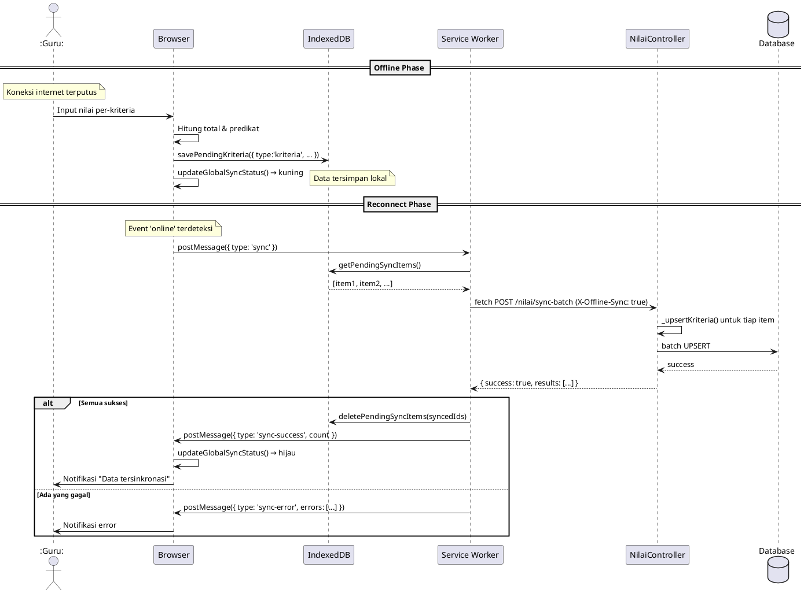
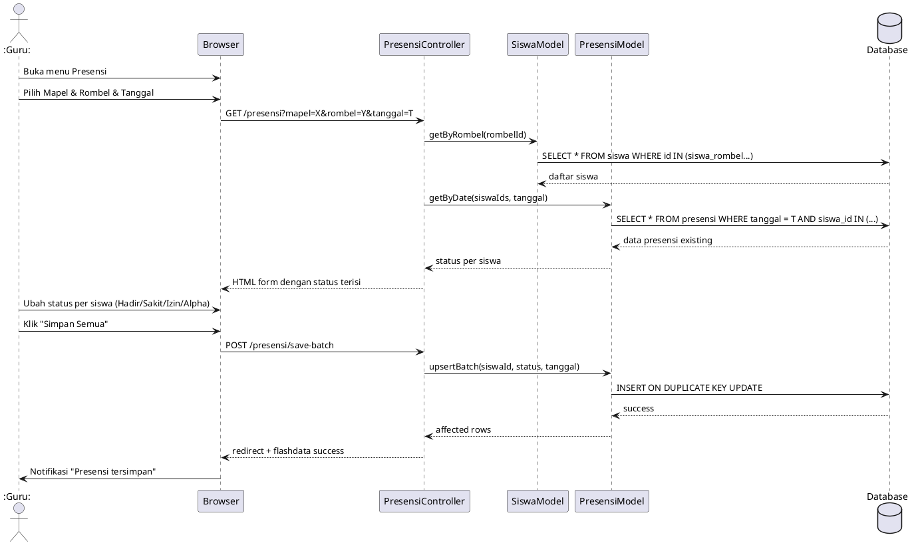
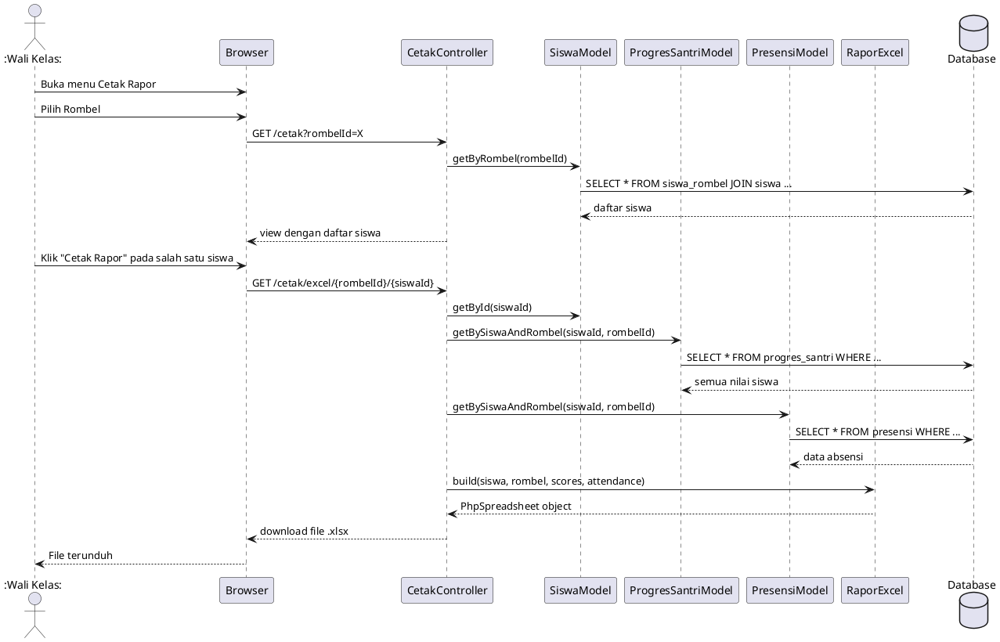
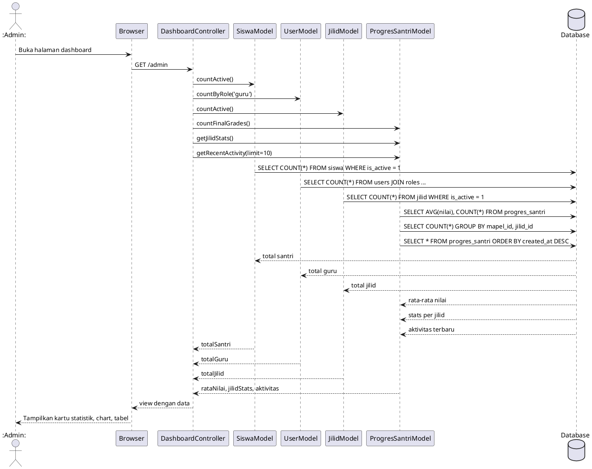

# Sequence Diagram — SIM Al-Miftah

---

## 1. Login Flow

---

## 2. Input Nilai Online

---

## 3. Input Nilai Offline + Sync

---

## 4. Presensi

---

## 5. Cetak Rapor Excel

---

## 6. Dashboard (Admin)

