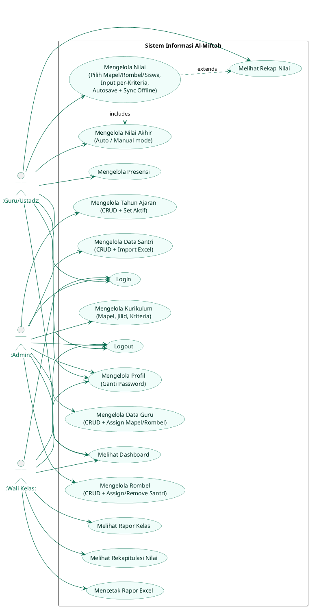

# Use Case Diagram — SIM Al-Miftah

```plantuml
@startuml
left to right direction
skinparam packageStyle rectangle
skinparam actorBorderColor #046C4E
skinparam actorFontColor #046C4E
skinparam useCaseBorderColor #046C4E
skinparam useCaseFontColor #022C22
skinparam useCaseBackgroundColor #F0FDFA
skinparam arrowColor #046C4E

actor ":Admin:" as Admin
actor ":Guru/Ustadz:" as Guru
actor ":Wali Kelas:" as WaliKelas

rectangle "Sistem Informasi Al-Miftah" {
  usecase "Login" as UC1
  usecase "Logout" as UC2
  usecase "Melihat Dashboard" as UC3

  usecase "Mengelola Data Santri\n(CRUD + Import Excel)" as UC4
  usecase "Mengelola Data Guru\n(CRUD + Assign Mapel/Rombel)" as UC5
  usecase "Mengelola Kurikulum\n(Mapel, Jilid, Kriteria)" as UC6
  usecase "Mengelola Rombel\n(CRUD + Assign/Remove Santri)" as UC7
  usecase "Mengelola Tahun Ajaran\n(CRUD + Set Aktif)" as UC8

  usecase "Mengelola Nilai\n(Pilih Mapel/Rombel/Siswa,\nInput per-Kriteria,\nAutosave + Sync Offline)" as UC9
  usecase "Mengelola Nilai Akhir\n(Auto / Manual mode)" as UC10
  usecase "Mengelola Presensi" as UC11
  usecase "Melihat Rekap Nilai" as UC12

  usecase "Melihat Rapor Kelas" as UC13
  usecase "Melihat Rekapitulasi Nilai" as UC14
  usecase "Mencetak Rapor Excel" as UC15

  usecase "Mengelola Profil\n(Ganti Password)" as UC16
}

Admin --> UC1
Admin --> UC2
Admin --> UC3
Admin --> UC4
Admin --> UC5
Admin --> UC6
Admin --> UC7
Admin --> UC8
Admin --> UC16

Guru --> UC1
Guru --> UC2
Guru --> UC3
Guru --> UC9
Guru --> UC10
Guru --> UC11
Guru --> UC12
Guru --> UC16

WaliKelas --> UC1
WaliKelas --> UC2
WaliKelas --> UC3
WaliKelas --> UC13
WaliKelas --> UC14
WaliKelas --> UC15
WaliKelas --> UC16

UC9 .> UC10 : includes
UC9 ..> UC12 : extends

@enduml
```
